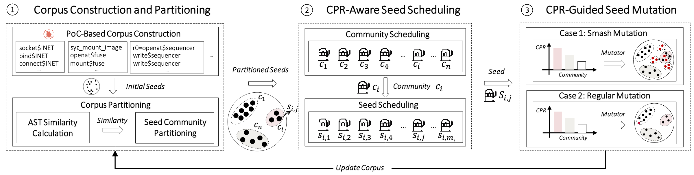

<div align="center">

# 🧬 SyzDiversity

**Diversity-Guided Linux Kernel Fuzzing**

[](SyzDiversity_code/LICENSE)
[](https://python.org/)
[](https://kernel.org/)

[Overview](#overview) · [Method](#method) · [Setup](#requirements) · [Communities](#prepare-the-initial-communities) · [Run](#configure-and-run) · [Tests](#tests)

</div>

---

<a id="overview"></a>

## 📖 Overview



While coverage-guided kernel fuzzers have been proposed to uncover Linux kernel vulnerabilities, their code coverage and bug-finding capability are limited due to the lack of seed diversity, which is caused by the compounding effect of initial seed generation, seed scheduling, and seed mutation. To address this limitation, we propose a diversity-guided kernel fuzzer SyzDiversity. Specifically, to mitigate overvaluation of early seeds, it leverages proof-of-concept (PoC) seeds derived from real-world vulnerabilities as initial seeds, and further partitions these seeds into multiple communities. To improve diversity guidance in seed scheduling, it leverages a novel metric, community popularity rate (CPR), to model community diversity, and introduces a CPR-aware hierarchical Multi-Armed Bandit (MAB) algorithm that integrates CPR and code coverage as reward signals to prioritize the scheduling of diverse seed communities and seeds. Further, to efficiently populate sparse communities or break through community boundaries, it adopts a CPR-guided seed mutation strategy that adaptively allocates higher mutation frequencies to communities that are more conducive to the diversity evolution of the seeds. Our extensive experiments on Linux kernel versions v5.15 and v6.14 have demonstrated that SyzDiversity improves code coverage and bug-finding capability by 17.2% and 6.4×, respectively, compared to the state-of-the-art kernel fuzzers. It has discovered 32 unique new vulnerabilities, with 12 of them confirmed.

### 📊 Results at a glance

| Code coverage improvement | Bug-finding improvement | New vulnerabilities | Confirmed |
| :---: | :---: | :---: | :---: |
| **17.2%** | **6.4×** | **32** | **12** |

*Paper results on Linux v5.15 and v6.14.*

<a id="method"></a>

## 🧠 Method

- 🧩 **Weighted AST partitioning.** The exporter and online classifier use the same
  ordered AST representation. Tree edit distance assigns cost 5 to syscall nodes,
  cost 1 to ordinary argument nodes, and cost 0 to pointer addresses and
  normalized image/ANY/AUTO fields. The default similarity is
  `1 - TED / max(node counts)`, exposed as `NTED2`.

- 🔗 **Community construction.** A symmetrized 200-nearest-neighbor graph retains
  positive similarities and excludes self-edges. Louvain partitions the graph;
  isolated seeds remain present. Each community, including singletons, gets a
  fixed medoid under normalized tree distance.

- 🎯 **Hierarchical scheduling.** Community and seed selection use historical UCB
  rewards. Community rewards combine crash-weighted new coverage with CPR. Seed
  rewards average offspring coverage gain per execution time, weighted by actual
  crash status. Zero-gain executions still contribute to the average.

- 🔄 **CPR-guided mutation.** The two highest-CPR communities receive batches of 25
  independent mutations; other communities receive one mutation per selection.
  Visits are counted once per parent selection and rewards once per completed
  batch. Triage and minimization reruns do not earn mutation rewards.

<a id="repository-layout"></a>

## 🗂️ Repository Layout

```text
SyzDiversity/
├── cluster_code/
│   ├── ast_distance.py                        # AST normalization and weighted TED
│   ├── 1.process_ast.py                       # Hash-indexed AST map
│   ├── 2.preprocess_trees.py                  # Ordered tree serialization
│   ├── 3.1compute_distance_matrix_optimized.py # Pairwise weighted distances
│   ├── 3.2compute_similarity_matrix.py        # NTED2 / NTED1 normalization
│   ├── 4.Louvain_clustering.py                # Graph construction and partitioning
│   ├── 5.cluster_center_finder.py             # Fixed community medoids
│   ├── requirements.txt
│   └── tests/test_partition.py
├── SyzDiversity_code/
│   ├── pkg/corpus/                           # ASTs, communities, rewards, UCB
│   ├── pkg/fuzzer/                           # Mutation batches and execution feedback
│   ├── pkg/mgrconfig/                        # Manager configuration and validation
│   ├── syz-manager/                          # Corpus and community initialization
│   ├── tools/syz-db/                         # Corpus database and AST export
│   ├── executor/                            # Target-side execution
│   └── vm/                                  # VM backends
├── prepared_data/                           # Seed databases and historical partitions
├── evaluation/                              # Experimental data
└── fig/                                     # Paper figures
```

<a id="requirements"></a>

## 🛠️ Requirements

| Component | Requirement |
| :--- | :--- |
| **Host** | A Linux host with QEMU/KVM for the Linux/amd64 workflow below. |
| **Go** | Go 1.22.1 or newer, as declared in `SyzDiversity_code/go.mod`. |
| **Python** | Python 3.8 or newer for offline partitioning. |
| **Build toolchain** | Make, a C/C++ toolchain, and the dependencies needed to build the target kernel. |
| **Kernel & guest** | A coverage-enabled kernel, a bootable VM image, and an SSH key for the guest. |

> [!TIP]
> Pairwise distance calculation performs `N * (N - 1) / 2` comparisons. Each dense
> float32 matrix uses `4 * N * N` bytes on disk; graph construction also creates
> in-memory copies and sorting arrays. Budget memory beyond the two matrix files
> and start with a small corpus before processing the full dataset.

### 1. Set up paths and Python dependencies

Replace the paths below with absolute paths. Use a new run directory outside the
checkout to keep generated data separate from source files. The following steps
assume the same shell and activated virtual environment.

```bash
export REPO="/path/to/SyzDiversity"
export RUN="/path/to/syzdiversity-run"
mkdir -p "$RUN"

python3 -m venv "$RUN/venv"
source "$RUN/venv/bin/activate"
python -m pip install -r "$REPO/cluster_code/requirements.txt"
```

### 2. Build the fuzzer and corpus tools

The build needs the complete source tree. Required packages such as
`SyzDiversity_code/pkg/build`, `pkg/cover`, and `pkg/instance` are currently
excluded from Git tracking; a fresh clone needs these source directories restored
before building. Their presence in an existing local workspace does not ensure
that they are included in a published checkout.

On the Linux host:

```bash
make -C "$REPO/SyzDiversity_code" TARGETOS=linux TARGETARCH=amd64
```

This builds the manager and corpus tools under `SyzDiversity_code/bin/`, and the
target binaries under `SyzDiversity_code/bin/linux_amd64/`.

For AST export alone, with generated syscall descriptions already available:

```bash
cd "$REPO/SyzDiversity_code"
go build -mod=vendor -o bin/syz-db ./tools/syz-db
```

### 3. Prepare the kernel and guest

Follow the bundled [Linux/amd64 QEMU setup guide](SyzDiversity_code/docs/linux/setup_ubuntu-host_qemu-vm_x86-64-kernel.md)
and [kernel configuration guide](SyzDiversity_code/docs/linux/kernel_configs.md).
Enable KCOV coverage collection and configure the guest for SSH access and
`debugfs`. Enable the sanitizers appropriate for the campaign, such as KASAN.
Keep the kernel build directory: the manager needs it for symbolization as well
as the bootable kernel image.

<a id="prepare-the-initial-communities"></a>

## 🧩 Prepare the Initial Communities

> [!IMPORTANT]
> Complete offline partitioning **before** starting the manager. Corpus hashes,
> ASTs, labels, and medoids must come from the same corpus and target. Regenerate
> older ASTs and partition files with this implementation rather than mixing them
> with newly computed distances.

### 1. Export ASTs from a corpus copy

> [!WARNING]
> The database loader may compact an opened database. Export from a working copy,
> not the original dataset or a running manager's database.

```bash
mkdir -p "$RUN/partition"
cp "$REPO/prepared_data/Seed/OurSeed.db" "$RUN/partition/input.db"

"$REPO/SyzDiversity_code/bin/syz-db" -os linux -arch amd64 \
    unpack "$RUN/partition/input.db" "$RUN/partition/export"
```

Serialized programs are written to `export/`; canonical, hash-named AST JSON
files are written to `export/AST_/`. Use the same OS and architecture as the
manager. Resolve any deserialization failures before continuing.

### 2. Normalize ASTs and compute weighted distances

```bash
cd "$RUN/partition"
python "$REPO/cluster_code/1.process_ast.py" \
    --input "$RUN/partition/export/AST_" --output asts.json
python "$REPO/cluster_code/2.preprocess_trees.py" \
    --input asts.json --output trees.pkl
python "$REPO/cluster_code/3.1compute_distance_matrix_optimized.py" \
    --trees trees.pkl --output distances.dat --syscall-cost 5 --jobs 8
```

Adjust `--jobs` to the host's resources. Unfinished distance entries remain NaN;
the normalization stage rejects incomplete or invalid matrices rather than
silently treating them as zero distances.

### 3. Normalize similarities and partition the graph

```bash
python "$REPO/cluster_code/3.2compute_similarity_matrix.py" \
    --trees trees.pkl --distance_matrix distances.dat \
    --method NTED2 --similarity_output similarities.dat
python "$REPO/cluster_code/4.Louvain_clustering.py" \
    --map_file asts.json --similarity_matrix similarities.dat \
    --method knn --k 200 --resolution 1.0 --output_csv cluster_info.csv
```

`NTED2` uses `1 - TED / max(node counts)`. Weighted distances may exceed the node
count; nonpositive similarities are excluded from graph edges, not clamped into
positive similarities. `NTED1` is available for sum-normalized ablations.
`NTED3` and `minmax` are not supported by the current normalization script.

### 4. Select fixed community medoids

```bash
python "$REPO/cluster_code/5.cluster_center_finder.py" \
    --cluster-info cluster_info.csv --ast-dir "$RUN/partition/export/AST_" \
    --output cluster_core.csv --syscall-cost 5 --jobs 8
```

The output files have the following schemas:

| File | Columns | Purpose |
| --- | --- | --- |
| `cluster_info.csv` | `Filename,Cluster` | Seed hash and community ID |
| `cluster_core.csv` | `ClusterID,SeedHash` | One fixed medoid per community |

The manager reads the two label columns by position; its later snapshots use
`ProgramHash,ClusterID` for the same seed-hash/community-ID mapping.

Keep `--syscall-cost` identical for distance computation, medoid selection, and
the manager's `diversity.syscall_cost` setting. Do not remove singleton
communities or replace medoids as communities grow.

### 5. Initialize a new manager work directory

The command chain below deliberately requires a new `workdir`. For a resumed
campaign, keep its existing corpus, community files, and centroid AST cache
instead of replacing them with initial artifacts.

```bash
mkdir "$RUN/workdir" &&
cp "$RUN/partition/input.db" "$RUN/workdir/corpus.db" &&
cp "$RUN/partition/cluster_info.csv" "$RUN/partition/cluster_core.csv" "$RUN/workdir/"
```

The manager loads labels and medoids before binding corpus programs. Missing or
conflicting medoids stop initialization. If `cluster_info.csv` is absent, the
manager logs a fallback to online assignment; that mode does not use the offline
Louvain initialization described above.

<a id="configure-and-run"></a>

## 🚀 Configure and Run

> [!NOTE]
> Save the following as `$RUN/fuzzing.cfg`, replacing every `/path/to/...` value.
> JSON paths are literal: shell variables such as `$RUN` are not expanded there.
> The `syzkaller` path must point to **`SyzDiversity_code`**, not the repository root.

```json
{
    "target": "linux/amd64",
    "http": "127.0.0.1:56741",
    "workdir": "/path/to/syzdiversity-run/workdir",
    "kernel_obj": "/path/to/linux-6.14",
    "image": "/path/to/vm-image/bullseye.img",
    "sshkey": "/path/to/vm-image/bullseye.id_rsa",
    "syzkaller": "/path/to/SyzDiversity/SyzDiversity_code",
    "procs": 8,
    "type": "qemu",
    "diversity": {
        "syscall_cost": 5,
        "cpr_weight": 7,
        "mutation_top": 2,
        "similarity_threshold": 0.4
    },
    "vm": {
        "count": 4,
        "kernel": "/path/to/linux-6.14/arch/x86/boot/bzImage",
        "cpu": 4,
        "mem": 2048
    }
}
```

### ⚙️ Diversity parameters

| Setting | Default | Meaning |
| :--- | :---: | :--- |
| `syscall_cost` | `5` | Syscall-node edit cost; integer >= 1, shared with offline processing |
| `cpr_weight` | `7` | CPR coefficient in the community reward; >= 1 |
| `mutation_top` | `2` | Number of highest-CPR communities receiving 25-mutation batches; integer >= 1 |
| `similarity_threshold` | `0.4` | Online community-assignment threshold; between 0 and 1 |

Omitting `diversity` uses these defaults. The offline graph's `--k 200` is separate
from manager configuration. Warm-up lasts four hours: each mutation selection has
a 0.25 probability of choosing a highest-CPR community with a random seed;
otherwise it uses hierarchical UCB. After warm-up, selection uses hierarchical
UCB. The duration, probability, and batch size of 25 are code defaults, not
manager JSON fields; the paper describes a small warm-up probability without
specifying its numeric value.

### ▶️ Start the manager

```bash
set -o pipefail
"$REPO/SyzDiversity_code/bin/syz-manager" -config="$RUN/fuzzing.cfg" \
    2>&1 | tee "$RUN/output.log"
```

- Open `http://127.0.0.1:56741` on the host to monitor the campaign.
- Follow logs with `tail -f "$RUN/output.log"` from another terminal.
- Stop with **Ctrl+C**. Ctrl+Z suspends the process rather than shutting it down.
- Preserve the work directory when restarting. Periodic community snapshots
  include `cluster_info.csv`, `cluster_core.csv`, and `ast_cache/`; cached centroid
  ASTs allow fixed medoids to survive corpus minimization.

<a id="tests"></a>

## 🧪 Tests

### Go regression tests

Run the focused Go regression tests from the fuzzer module:

```bash
cd "$REPO/SyzDiversity_code"
go test -mod=vendor -race -short ./pkg/corpus ./pkg/fuzzer ./pkg/fuzzer/queue
go test -mod=vendor -race -run '^TestDiversityConfig$' ./pkg/mgrconfig
```

### Python partitioning tests

Run offline partitioning tests in the Python environment created above:

```bash
cd "$REPO/cluster_code"
python -m unittest discover -s tests -p 'test_*.py' -v
```

These tests cover weighted TED reference cases, AST normalization, community
assignment and persistence, historical reward accounting, mutation batches,
configuration validation, graph filtering, and singleton medoids. They do not
replace a Linux VM fuzzing campaign or reproduce the paper's performance results.

<a id="license"></a>

## 📄 License

See the [Apache License 2.0](SyzDiversity_code/LICENSE).

<a id="acknowledgments"></a>

## 🙏 Acknowledgments

- The [syzkaller](https://github.com/google/syzkaller) team for the underlying
  fuzzing framework.
- The Linux kernel development community.
- Contributors to the graph partitioning and scientific computing libraries.
